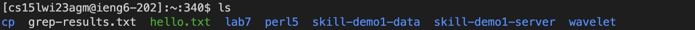
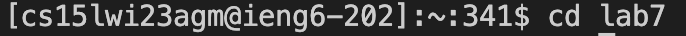

# lab7report
## 4. Log into ieng6
 
 Enter the account name of ieng6 and press <enter>
 
  If you have the password enter it and press <enter>
## 5. Clone your fork of the repository from your Github account
  
 Clone the repository and press <enter>
## 6. Run the tests, demonstrating that they fail
  
 
 
 
 
 
 
 
 
## 7. Edit the code file to fix the failing test
## 8. Run the tests, demonstrating that they now succeed
## 9. Commit and push the resulting change to your Github account (you can pick any commit message!)

