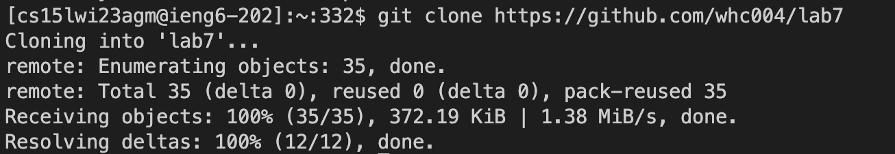
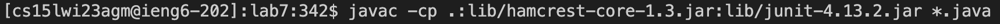
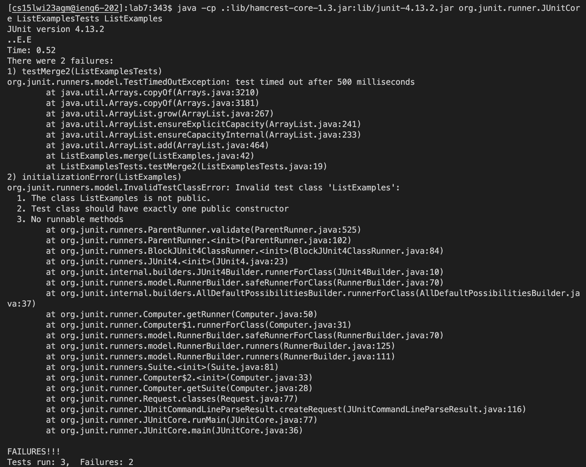

# lab7report
## 4. Log into ieng6
## 5. Clone your fork of the repository from your Github account
## 6. Run the tests, demonstrating that they fail
## 7. Edit the code file to fix the failing test
## 8. Run the tests, demonstrating that they now succeed
## 9. Commit and push the resulting change to your Github account (you can pick any commit message!)
 
 
 
 
 
 
 
 
 
 
 
 
 
