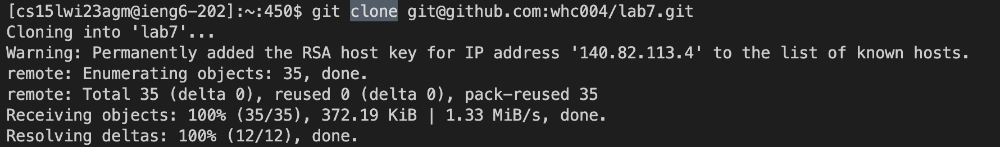
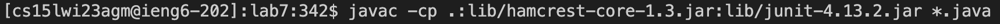
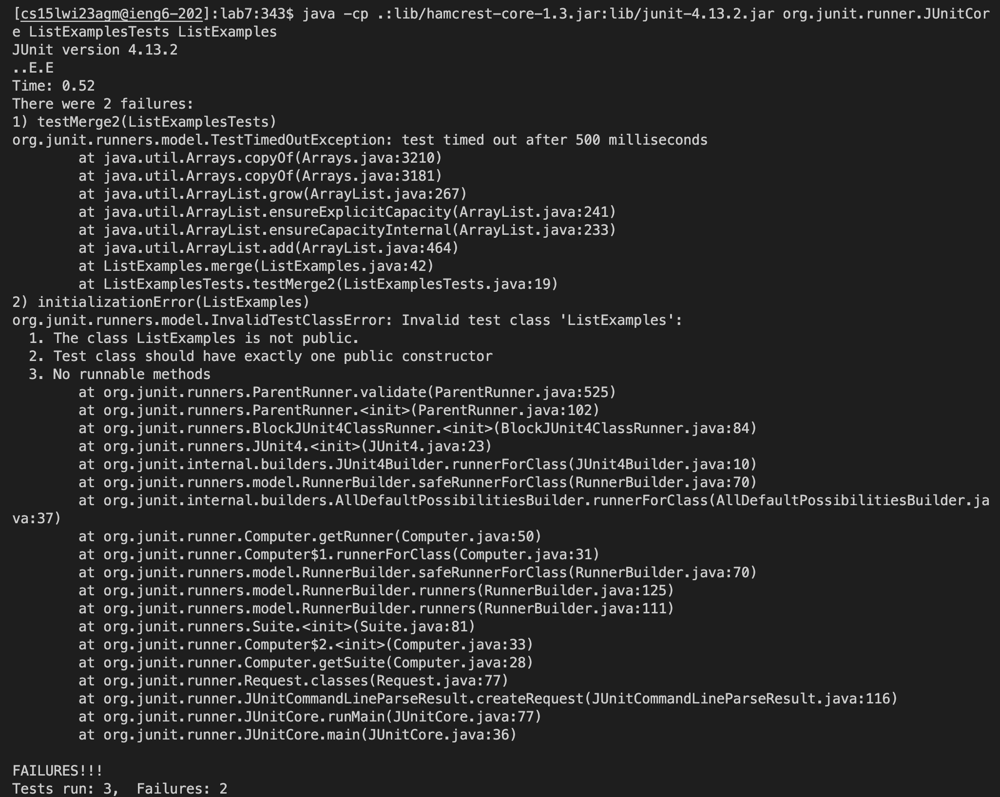
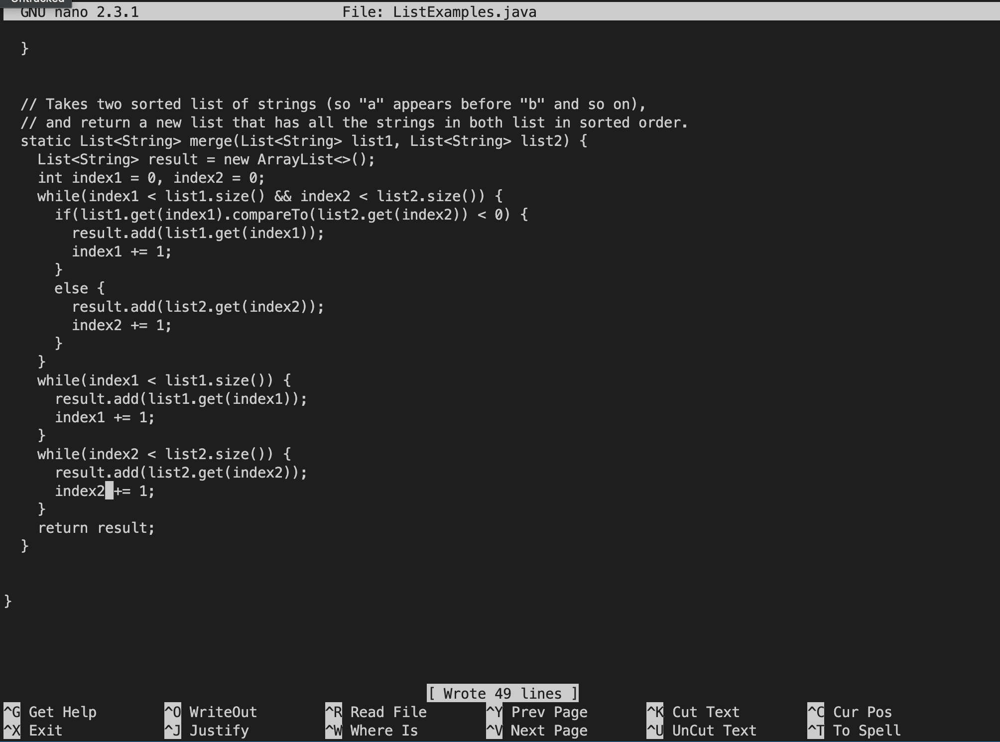
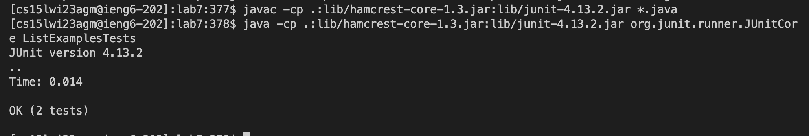
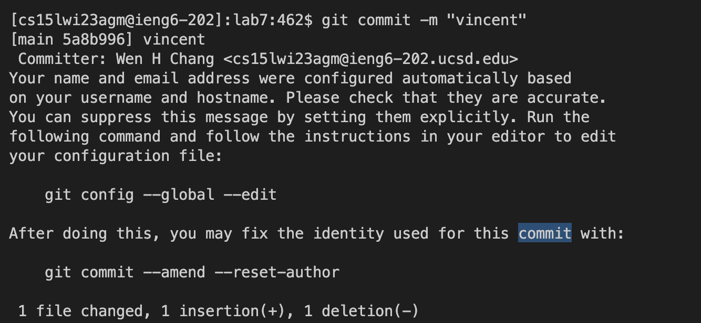
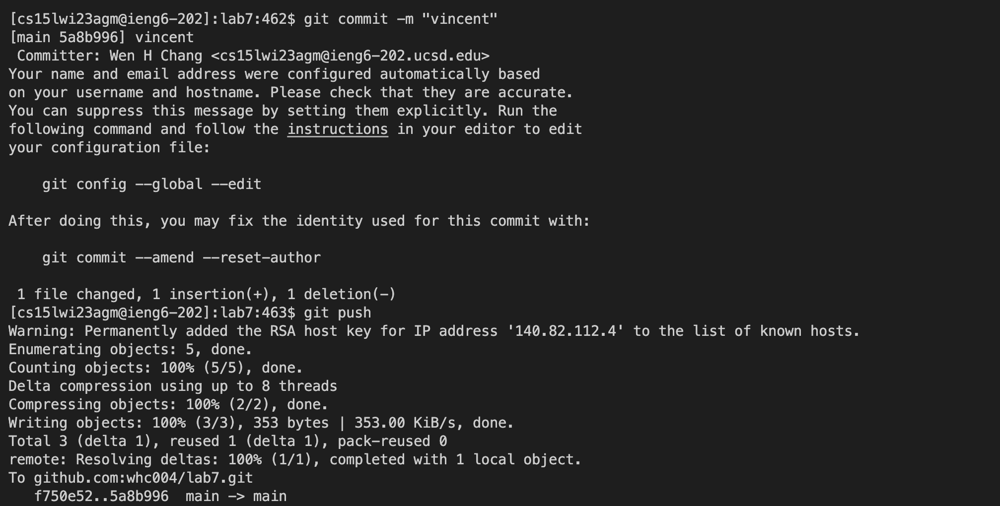

# lab7report

## 4. Log into ieng6


Log in by the account name of ieng6 and press `<Enter>` (need to cancel the password first)

## 5. Clone your fork of the repository from your Github account
 Clone the repository(the website should get form lab7 > code(green bottom) > copy the ssh) and press `<Enter>` after you paste the url in

## 6. Run the tests, demonstrating that they fail
 Go to the lab7 to compile it(``` javac -cp .:lib/hamcrest-core-1.3.jar:lib/junit-4.13.2.jar *.java``` ) and run it(``` java -cp .:lib/hamcrest-core-1.3.jar:lib/junit-4.13.2.jar org.junit.runner.JUnitCore ListExamplesTests ListExamples``` ) by entering the code and pressing `<enter>` (you need to be at lab7 which can checked by ```ls``` if not you should go to the lab7 by```cd``` first)


## 7. Edit the code file to fix the failing test
 Use nano to change the file by using ``` nano ListExamples.java``` and press  `<Enter>`
 After that, you will get this:
 
 Press <down> until you see ``` while(index2 < list2.size()) {
      result.add(list2.get(index2));
      index1 += 1;
    }``` change it to ``` while(index2 < list2.size()) {
      result.add(list2.get(index2));
      index2 += 1;
    }``` 
 press `<ctrl+X>` to exit          
 
## 8. Run the tests, demonstrating that they now succeed
  Go to the lab7 to compile it(``` javac -cp .:lib/hamcrest-core-1.3.jar:lib/junit-4.13.2.jar *.java``` ) and run it(``` java -cp .:lib/hamcrest-core-1.3.jar:lib/junit-4.13.2.jar org.junit.runner.JUnitCore ListExamplesTests ListExamples``` ) by entering the code and pressing `<Enter>` (you need to be at lab7 which can checked by ```ls``` if not you should go to the lab7 by```cd``` first)

## 9. Commit and push the resulting change to your Github account (you can pick any commit message!)
 Commit it by ```git commit -m "MESSAGE_YOU_WANT"``` and press `<Enter>`

 Use ```git push```to push it and press `<Enter>`


 Finish
